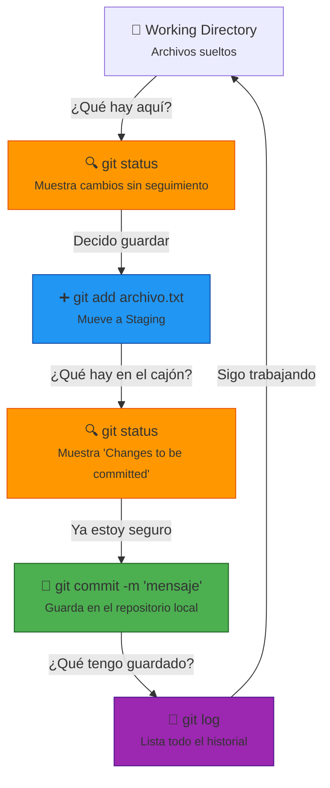
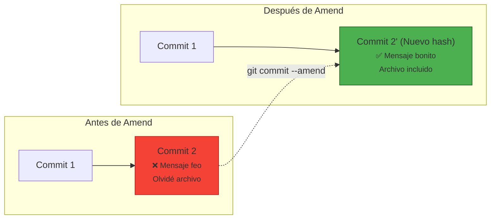

# El Cuarteto Fundamental: status, add, commit y log

> **TL;DR:** `status` te dice *dónde estás*, `add` te dice *qué vas a guardar*, `commit` *guarda* la foto, y `log` te enseña el *álbum de fotos* entero.

## 🧠 Analogía del Mundo Real (El Fotógrafo)
Imagina que eres un fotógrafo documentando una obra de construcción:

1. **`git status` (El Asistente de Producción)**: Grita cada 5 minutos: *"¡Oye! La grúa está movida, hay ladrillos nuevos en el suelo, pero la excavadora sigue igual. ¿Qué quieres hacer con esto?"* Te da el inventario exacto del caos.
2. **`git add` (El Seleccionador de Fotos)**: Tomas tu cámara, enfocas SOLO la grúa y los ladrillos, y los pones en un carrete aparte. Le dices al asistente: *"De todo lo que hay ahí, esto es lo que voy a revelar"*.
3. **`git commit` (El Revelado)**: Tomas ese carrete y lo conviertes en una foto física, la pones en un álbum con una etiqueta que dice *"Día 3 - Cimientos"*. Ya es imborrable.
4. **`git log` (El Índice del Álbum)**: Abres la primera página del álbum y ves el listado de todas las fotos que has tomado hasta hoy, con su fecha y su etiqueta.

## 📊 Diagrama de Flujo Integrado (El Ciclo de Vida)

## 🔧 Ampliación: El Poder del --amend (El Retoque Fotográfico)

> **TL;DR:** `--amend` te permite **corregir** el último commit: cambiar su mensaje, añadir archivos que se te olvidaron, o quitar archivos que no debían ir, **sin crear un commit nuevo**.

### 🧠 Analogía del Mundo Real (El Fotógrafo Perfeccionista)
Siguiendo con nuestra analogía del álbum de fotos:

1. Hiciste el `commit` (revelaste la foto) y la pegaste en el álbum.
2. De repente, te das cuenta de que en la foto sale un dedo tapando el lente, o te olvidaste de enfocar a un actor importante.
3. **`--amend`** es como tener una **máquina del tiempo** que te permite arrancar esa foto, retocarla en el cuarto oscuro, y volver a pegarla en el **mismo lugar** del álbum, con la misma etiqueta de fecha (aunque en realidad la fecha de retoque es nueva).

### 📊 Diagrama de Flujo: Antes vs Después de --amend

